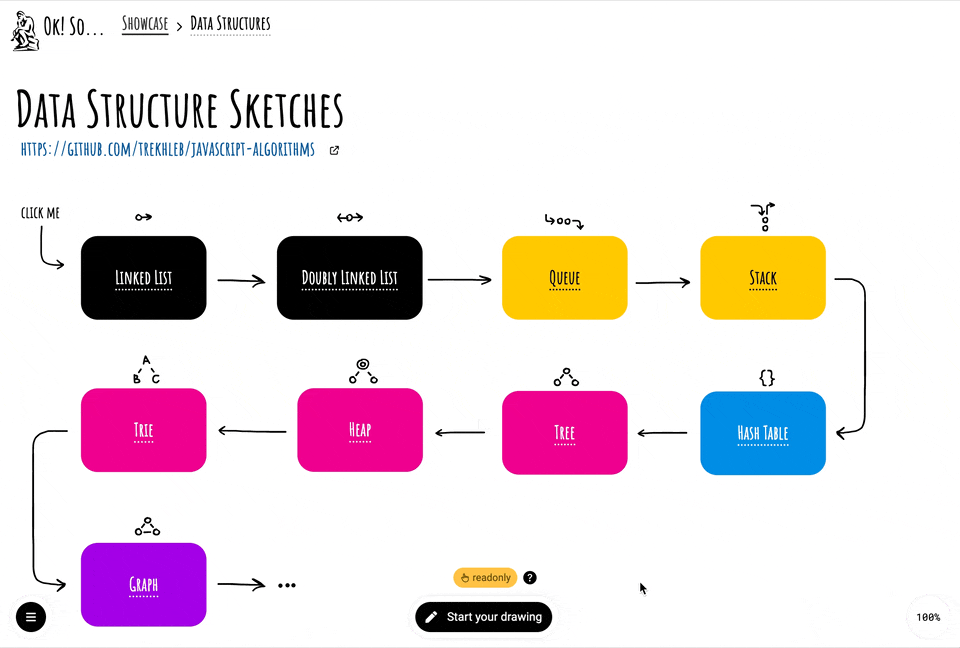

# ✍🏻 OkSo Showcase

This folder contains examples of drawings that were made using the [okso.app](https://okso.app).

These drawings are available on the [okso.app/showcase](https://okso.app/showcase)

Here is an example of the [Data Structure Sketches](https://okso.app/showcase/data-structures) showcase:

## Contribution Guide

If you would like to contribute your example of the okso.app showcase please follow the next steps:

- [ ] Create a sub-folder inside the [/showcase/community](./community/) folder (i.e. `/showcase/community/data-structures`)
- [ ] Create your sketch using the [okso.app](https://okso.app)
  - [ ] Export your sketch via `File → Save` menu to the file with the `.okso` extension.
  - [ ] Put this file inside the directory from the first step (i.e. `/showcase/community/data-structures/data-structures.okso`)
- [ ] Inside your showcase directory create a `README.md` file with the following information (see the [/showcase/okso/data-structures/README.md](./okso/data-structures/README.md) for example)
  - [ ] `Title` - concise name of your sketch (i.e. `Data Structures`)
  - [ ] `Description` - one sentence description of what your sketch is about (i.e. `Basic data structures explained with minimalistic sketches.`)
  - [ ] `Author` - name and the link to the author of the sketch (i.e. `[Oleksii Trekhleb](https://twitter.com/Trekhleb)`)
  - [ ] _(Optional)_ `Cover` - the cover image for your showcase (i.e. the image with `.jpg` or `.png` extension of size `1024x640px`)
  - [ ] Create a pull-request

> ❗️ Not all sketches might be accepted. Remember, that sketches should add value and be useful for the community.

In the future we plan to introduce "Accounts" in okso.app to make contribution process much simpler. 
