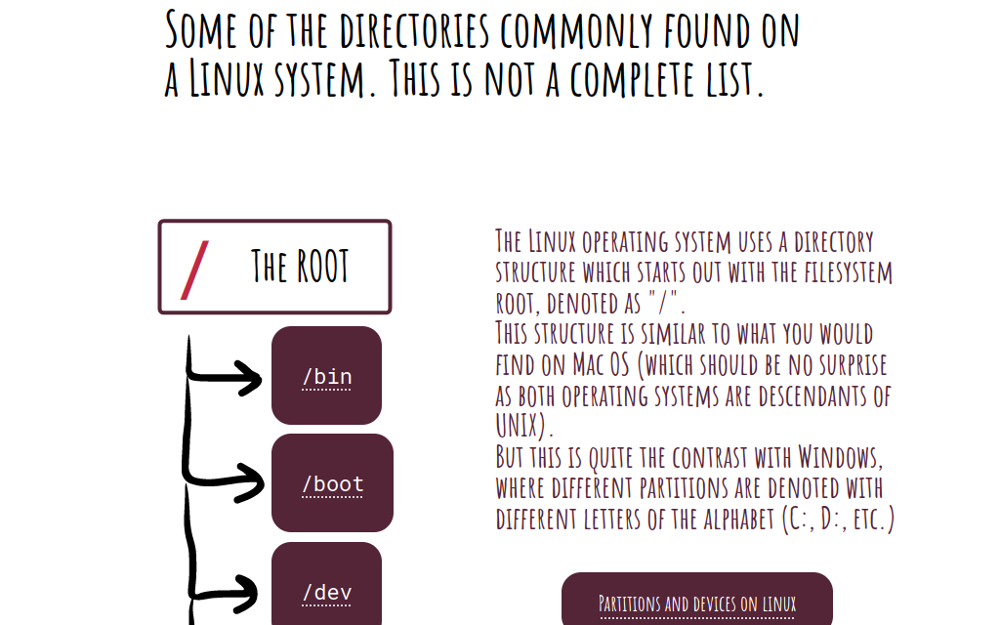

# Data Structures

## File (.okso)

[linux-directory-structure.okso](./linux-directory-structure.okso)

## Description (1 sentence)

Most common Linux directories explained.

## Covers (1024x640px)

[cover-01.png](./cover-01.png)

## Author (with link)

[László Heim](https://github.com/Lasoloz)

