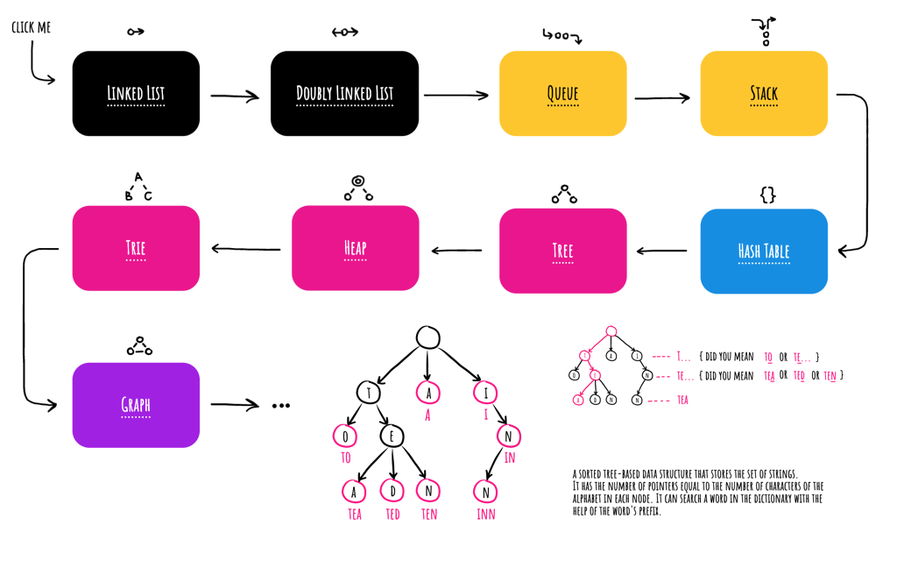

# Data Structures

## File (.okso)

[data-structures.okso](./data-structures.okso)

## Description (1 sentence)

Basic data structures explained with minimalistic sketches.

## Covers (1024x640px)

[cover-03.png](./cover-03.png)

## Author (with link)

[Oleksii Trekhleb](https://twitter.com/Trekhleb)
