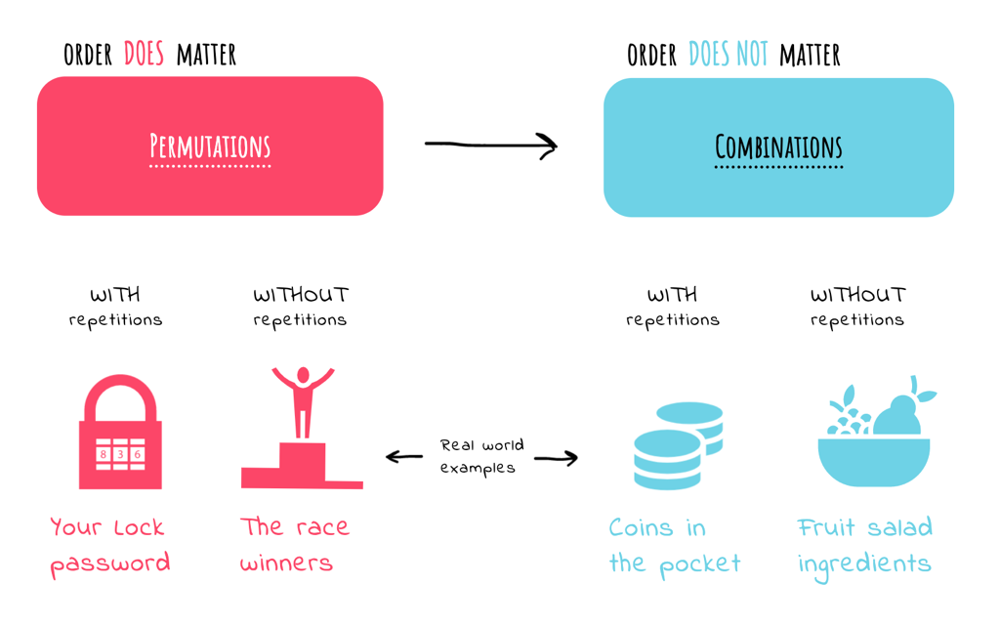

# Permutations & Combinations

## File (.okso)

[permutations-and-combinations.okso](./permutations-and-combinations.okso)

## Description (1 sentence)

A cheatsheet on how to do permutations and combinations

## Covers (1024x640px)

[cover-01.png](./cover-01.png)

## Author (with link)

[Oleksii Trekhleb](https://twitter.com/Trekhleb)