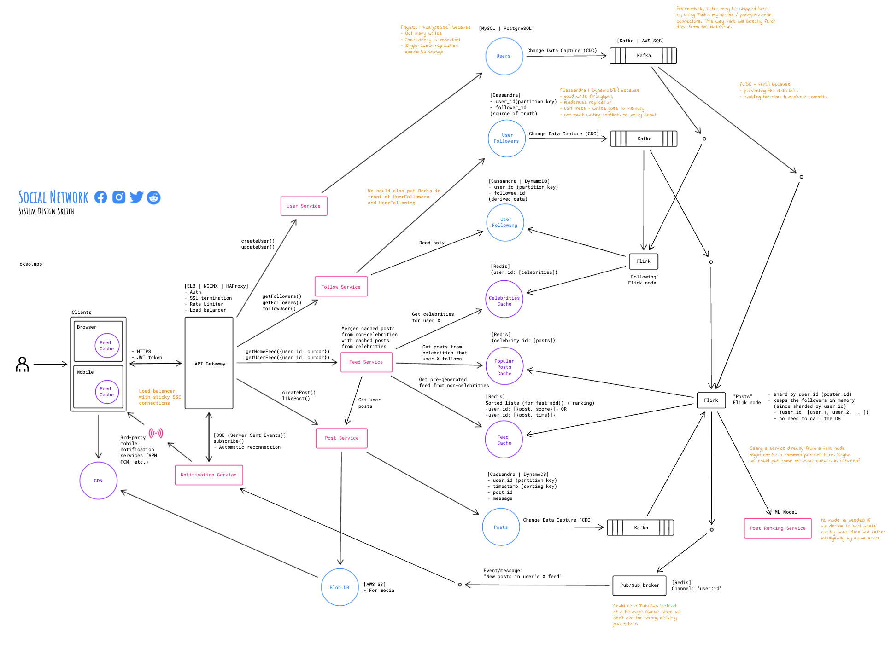
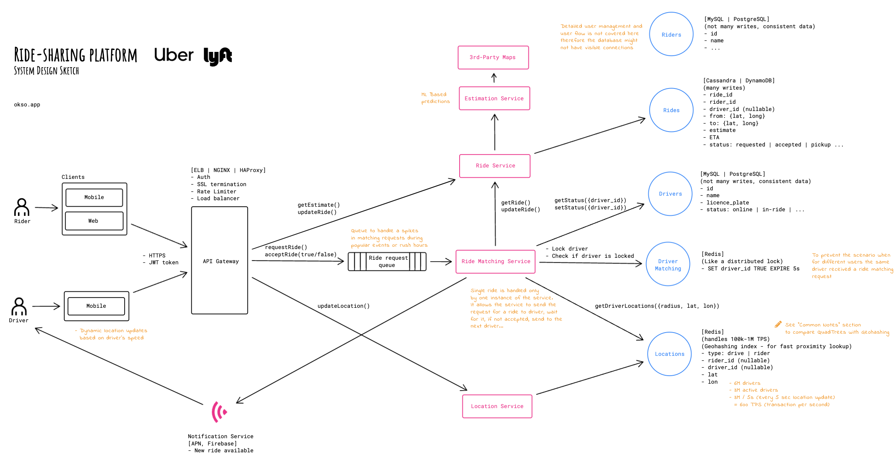
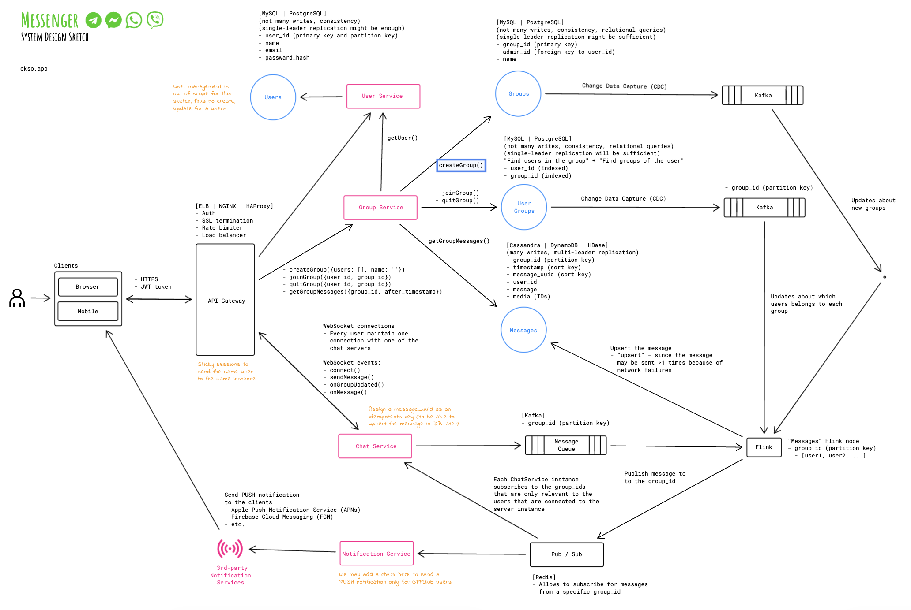
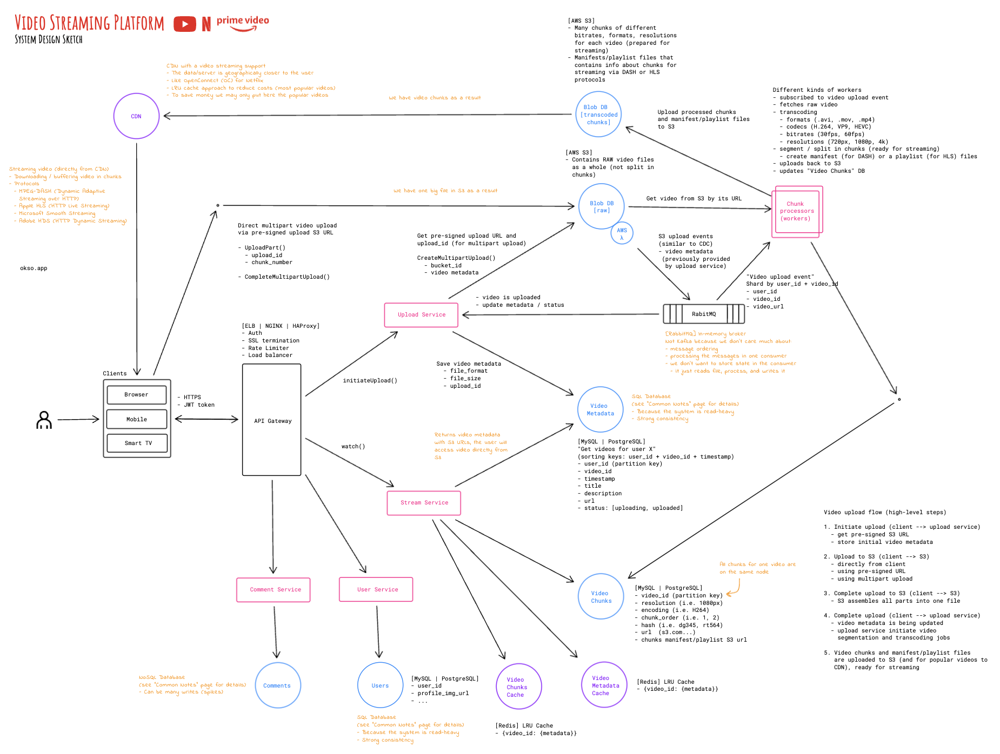
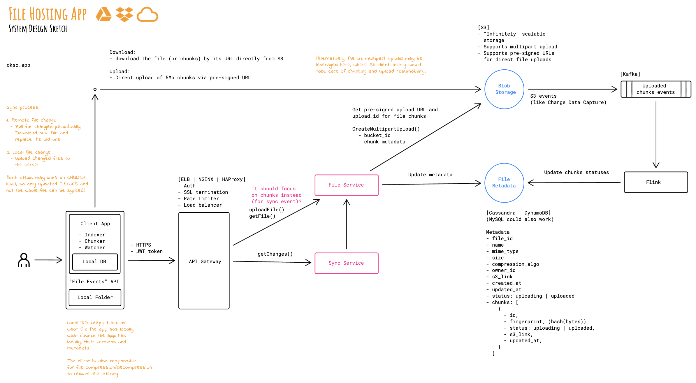
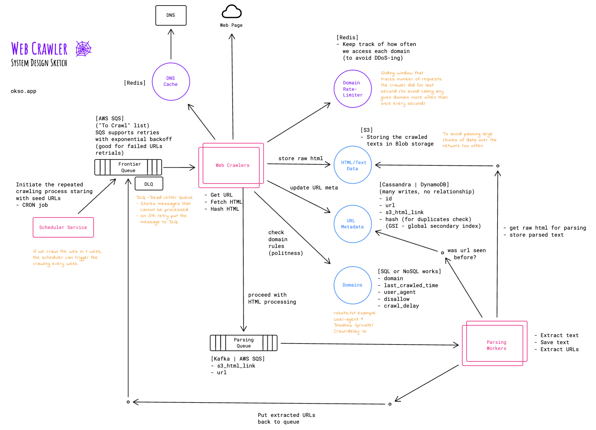

# System Design Sketches

https://okso.app/showcase/system-design

## File (.okso)

The file that contains the source code of the System Design Sketches: 

- [system-design.okso](./system-design.okso)

This file may be edited via the https://okso.app _(Menu > File > Open/Save)_. 

## Description (1 sentence)

System design sketches for system design interviews.

### Social network

### Ride Sharing App

### Messenger

### Video streaming app

### File hosting app

### Web crawler

## Covers (1024x640px)

[cover-01.png](./cover-01.png)

## Author (with link)

[Oleksii Trekhleb](https://twitter.com/Trekhleb)
